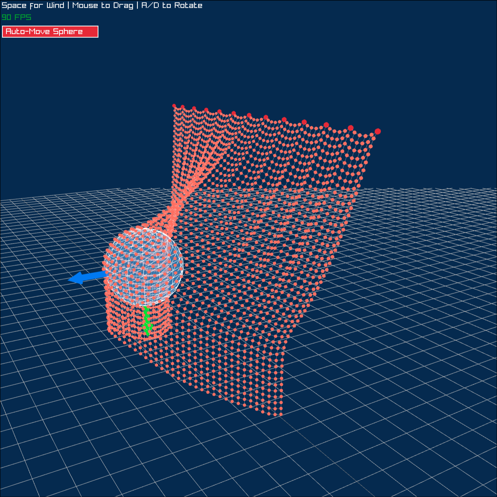

# Cloth Simulation

A real-time 3D cloth simulation implemented in C using [Raylib](https://www.raylib.com/), physics based on Thomas Jakobsen's 2001 paper ["Advanced Character Physics"](https://www.cs.cmu.edu/afs/cs/academic/class/15462-s13/www/lec_slides/Jakobsen.pdf).



## Features

- **Verlet Integration** - Position-based physics for stable simulation
- **Constraint Satisfaction** - Distance constraints maintain cloth structure
- **Sphere Collision** - Interactive collision with a movable sphere
- **Real-time Interaction** - Drag particles and control the scene with mouse/keyboard

## Controls

| Input | Action |
|-------|--------|
| `A` / `D` or `←` / `→` | Rotate camera |
| `Space` | Apply wind force |
| `Left Click + Drag` on particles | Drag particles |
| `Left Click + Drag` on arrows | Move collision sphere |

## Building

The build system automatically downloads the appropriate Raylib 5.5 binaries for your platform.

### Linux

```bash
cc nob.c -o nob
./nob && ./main
```

### macOS

```bash
cc nob.c -o nob
./nob && ./main
```

### Windows

**Using MinGW:**
```bash
gcc nob.c -o nob.exe
nob.exe
main.exe
```

**Using MSVC (Visual Studio Developer Command Prompt):**
```bash
cl nob.c
nob.exe
main.exe
```

## Requirements

- C compiler (gcc, clang, or MSVC)
- `curl` for downloading Raylib
- `tar` (Linux/macOS) or PowerShell (Windows) for extraction

Raylib is automatically downloaded on first build - no manual setup required!

## References

- [Advanced Character Physics - Thomas Jakobsen (2001)](https://www.cs.cmu.edu/afs/cs/academic/class/15462-s13/www/lec_slides/Jakobsen.pdf)
- [Raylib](https://www.raylib.com/)

## License

MIT License - See [LICENSE](LICENSE) for details
